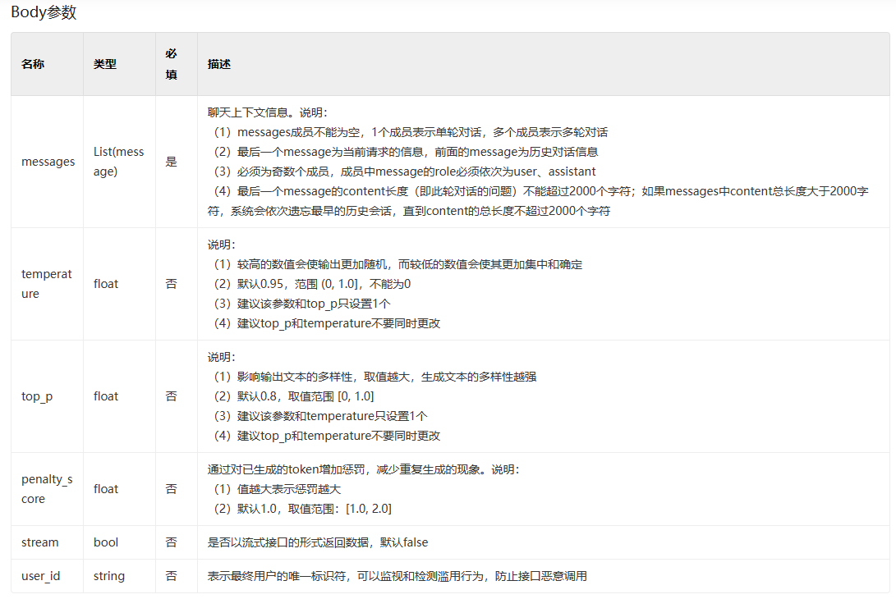

# 百度文心Erniebot

本文将会介绍百度文心系列大模型的使用，要使用其能力，你需要前往[百度千帆大模型平台](https://console.bce.baidu.com/qianfan/ais/console/applicationConsole/application)创建大模型应用并获取到对应的`API Key`和`Secret Key`。

同理你想使用国产文心系列模型，只需要 ErnieBot()进行初始化，文心模型虽然与openai模型有较大差异，但是框架提供了尽可能完美的兼容。
你还可以使用ErnieBot(model="ernie-bot")来具体选择对应的文心模型，目前框架提供了两种文心模型，分别是文心一言（"ernie-bot"）和文心turbo（"ernie-bot-turbo"）,默认为文心turbo模型。


### KEY配置

在使用百度千帆大模型平台系列的LLM之前，你需要先导入你的`API Key`和`Secret Key`

```python
import os

os.environ["ERNIE_API_KEY"] = "your api key"
os.environ["ERNIE_API_SECRET"] = "your secret key"

```

在你第一次使用的时候，需要使用上述代码导入环境变量，但是在第一运行之后`promptulate` 会进行缓存，即后面再运行就不需要再导入key了。

如果你的key过期了，可以尝试重新按照上面的方法导入key，或者你也可以把 `cache` 文件给删除掉，通过以下代码可以获取到缓存文件的位置:

```python
from promptulate.utils import get_default_storage_path

print(get_default_storage_path())
```


### LLM快速上手

`promptulate`的架构设计可以轻松兼容不同的大语言模型扩展，在`promptulate`中，llm负责最基本的内容生成部分，因此为最基础的组件。

下面的示例展示了如何使用百度文心ErnieBot的大语言模型进行交互。

```python
from promptulate.llms import ErnieBot

llm = ErnieBot() 
answer = llm("请解释一下引力波的放射与广义相对论的必然关系")
print(answer)

```

> 上述ErnieBot默认使用`ernie-bot-turbo`模型

输出结果如下：

```text
广义相对论是一种描述引力如何影响时空的物理学理论，它指出当物质和能量聚集在一起时，它们弯曲了周围的时空，引起了引力。质量和能量更大的物体会导致更大
的时空弯曲，这就是为什么地球会围绕太阳旋转。根据广义相对论，当物质或能量在空间中运动时，它们会产生引力波，就像在水面上产生涟漪一样。引力波是一种类
似电磁波的波动，但它们是由物质和能量的弯曲引起的，而电磁波是由电荷的振动引起的。引力波是极微弱的，但是当强烈的引力场存在（例如在引力天体碰撞或超新
星爆炸等事件中），它们可以被探测到。事实上，2015年，激光干涉引力波天文台利用引力波探测器直接探测到了引力波，并为广义相对论提供了强有力的证据。因
此，引力波的放射与广义相对论必然关系紧密。通过引力波，我们可以更加深入地了解时空的性质，并进一步验证这个理论。
```

### 切换模型

文心提供了 "ernie-bot"与"ernie-bot-turbo"，详情介绍查看[官方文档](https://cloud.baidu.com/doc/WENXINWORKSHOP/s/Jlfmc9dit)与[API文档](https://cloud.baidu.com/doc/WENXINWORKSHOP/s/Nlks5zkzu)

**ERNIE-Bot-turbo**

文心一言人工智能大语言模型，拥有产业级知识增强文心大模型ERNIE，具备跨模态、跨语言的深度语义理解与生成能力。

**ERNIE-Bot**

文心一言大语言模型，基于飞桨深度学习平台和文心知识增强的强大模型，持续从海量数据和大模型知识中融合学习。具备知识增强、检索增强和对话增强的技术特色。

你可以使用如下方式切换模型：

```python
from promptulate.llms import ErnieBot

llm = ErnieBot(model="ernie-bot") 
answer = llm("请解释一下引力波的放射与广义相对论的必然关系")
print(answer)
```

### 参数配置

ErnieBot相关模型的参数如下所示：



你可以使用如下方式进行参数配置：

```python
from promptulate.llms import ErnieBot

llm = ErnieBot(temperature=0.1, top_p=0.8) 
answer = llm("请解释一下引力波的放射与广义相对论的必然关系")
print(answer)
```

### Stop停词

什么是Stop停词？事实上，stop是一个字符串数组，如`["action", "observation"]`，在LLM生成文本的过程中，如果检测到LLM当前生成本文为stop数组里的内容，则LLM就会停止文本生成，该功能一般用于一些复杂应用程序的开发上，下面的示例展示了stop的使用。

> 文心本身不具有Stop停词功能，Promptulate对该模型做了特别优化，让ErnieBot可以支持与OpenAI相同的停词功能。


```python
from promptulate.llms import ErnieBot

llm = ErnieBot(temperature=0)
prompt = """
Please strictly output the following content.
[start] This is a test [end]
"""
result = llm(prompt, stop=["test"])
```

输出结果如下：

```text
[start] This is a
```

llm是否支持stop，要看其LLM模型本身是否支持，当前OpenAI系列的产品支持stop，因此你可以`ChatOpenAI` `OpenAI`都可以使用上面的方式进行调用。
文心系列模型不支持stop, 但是Promptulate框架本身集成了代码层面的stop能力，因此你可以使用ErnieBot进行stop相关能力的开发。