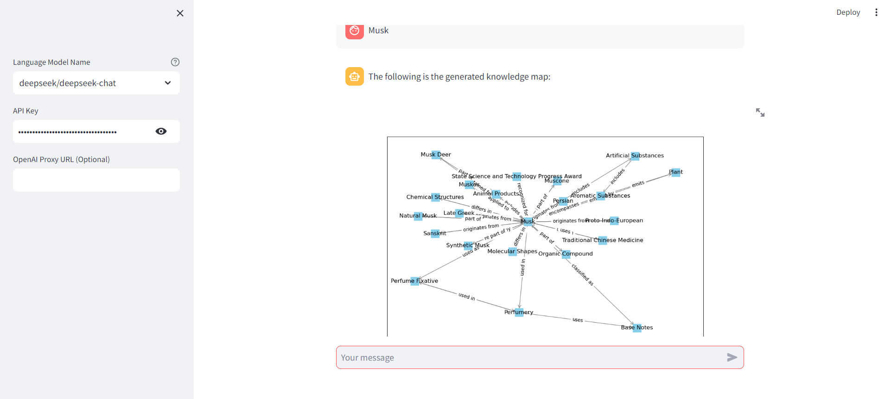

# LLMapper

An experiment in using LLMs, wikipedia and promptulate to draw simple concept maps.

LLMapper is a crude prototype for refining the prompts. Which is to say, this isn't (yet) a serious tool; it's a toy for learning about generative AI. 

It's very early days. Among other things, there's no error detection or graceful failures. Use at your own risk.


## Quick Start

1. Clone the repository and install the dependencies

```shell
git clone https://www.github.com/Undertone0809/promptulate
```

2. Switch the current directory to the example

```shell
cd promptulate/example/llmapper
```

3. Install the dependencies

```shell
pip install -r requirements.txt
```

4. Run the application

```shell
streamlit run app.py
```

5. Select the name of the model to be used and enter the key, and enter the keywords to draw the knowledge map in the user input box 

## Sample Output



See more samples at [modelor.ai](https://modelor.ai).

## How It Works

1. Use wikipedia_search tool to retrieve relevant content based on the keywords entered by the user
2. Summarize the content retrieved by wikipedia_search tool and extract important concepts
3. Analyze the relationships and hierarchies between concepts, and draw a knowledge map using networkx and Graphviz
